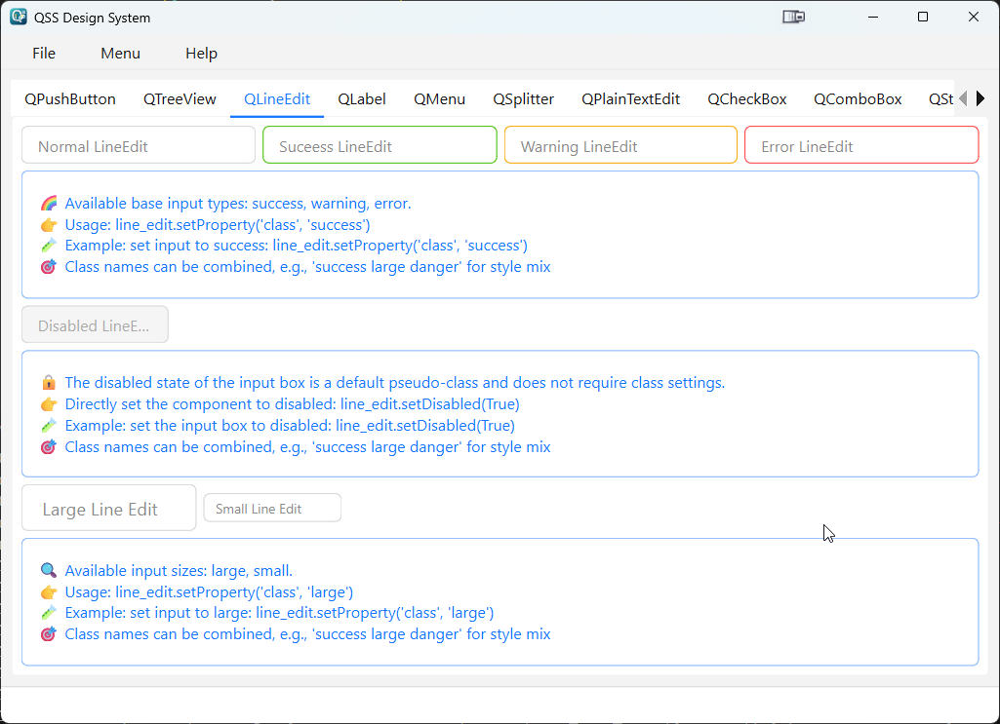

# qss-design-system

[中文文档](README.zh_CN.md)

A QSS design system and packaging tool for PySide6 (Qt for Python) desktop applications.

The goal of this project is to provide a set of QSS-based component styles, allowing other PySide6 projects to achieve a consistent and reusable UI style (visual reference: Ant Design) by simply importing the generated `.qss` file and icon resources.

## Project Structure

-   `src/main/ui/` - Contains `qss_desigin_system.qss`, `icons/`, and other UI resources
-   `src/main/style/` - SCSS source files (compiled to QSS via `build.py`)
-   `src/main/build.py` - Script to compile SCSS to QSS (using libsass)
-   `scripts/package_qss.ps1` - Windows PowerShell script: reads version from `pyproject.toml` and packages `.qss` and `icons/` into `qss-desigin-system.<version>.zip`
-   `pyproject.toml` - Project metadata (version, dependencies, Python requirements, etc.)

## Quick Start

This project uses `uv` to manage dependencies and runtime environment. The examples below demonstrate common operations in Windows / PowerShell.

1. Verify `uv` is available:

    ```powershell
    uv --version
    ```

2. Sync/install project dependencies (based on `pyproject.toml`):

    ```powershell
    uv sync
    ```

3. Compile SCSS to QSS (run in uv-managed environment):

    ```powershell
    uv run python src/main/build.py

    # Alternative (if not using uv)
    & .\.venv\Scripts\python.exe src\main\build.py
    ```

4. Run the example application in uv environment (to preview styles):

    ```powershell
    uv run python src/main/qss_desigin_system.py

    # Alternative (if not using uv)
    & .\.venv\Scripts\python.exe src\main\qss_desigin_system.py
    ```

5. Package QSS and icons into a versioned ZIP:

    ```powershell
    # Run PowerShell packaging script in uv-managed environment:
    uv run pwsh -File .\scripts\package_qss.ps1

    # Or run directly in host shell:
    .\scripts\package_qss.ps1
    # Output file will be at ./dist/qss-desigin-system.<version>.zip
    ```

## Usage

-   The packaged zip contains `qss_desigin_system.qss` and the `icons/` folder.
-   When integrating into your target project:
    -   Place `qss_desigin_system.qss` in your project resource directory and load it as the application style at startup (e.g., `QApplication.setStyleSheet(...)`).
    -   Maintain the relative path of `icons/` or modify `url(...)` paths as needed.

Example (PySide6):

```python
from PySide6.QtWidgets import QApplication
app = QApplication([])
# Assuming qss path and icons path are correctly set
with open('path/to/qss_desigin_system.qss', 'r', encoding='utf-8') as f:
    app.setStyleSheet(f.read())
```

## Compatibility and Notes

-   The Python version range declared in `pyproject.toml` is recommended to be `>=3.9, <3.14` (PySide6 >=6.9 supports Python 3.9–3.13).
-   QSS rendering may have subtle differences across platforms (Windows/Linux/macOS); fine-tune on target platforms as needed.



## Contributing

Issues and pull requests are welcome:

-   Fix style issues or add component styles
-   Add more UI examples
-   Improve packaging scripts (cross-platform) and add automated tests

Before submitting a PR, please ensure:

-   Run `src/main/build.py` locally and check the generated QSS
-   Provide clear change descriptions and screenshots (if visual adjustments)

## License

This project is licensed under the MIT License. See `LICENSE.txt` for details.
